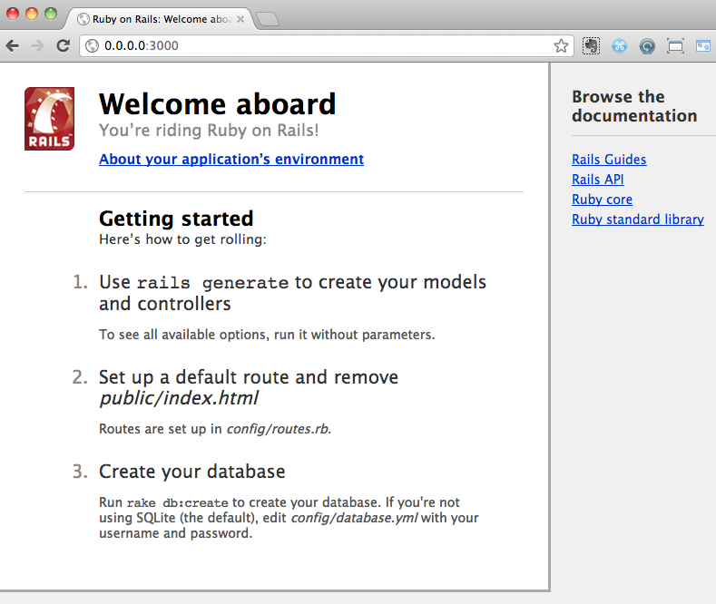
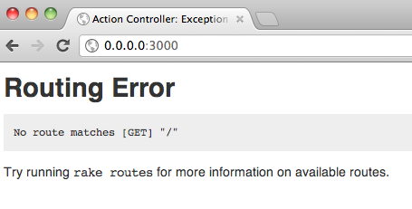
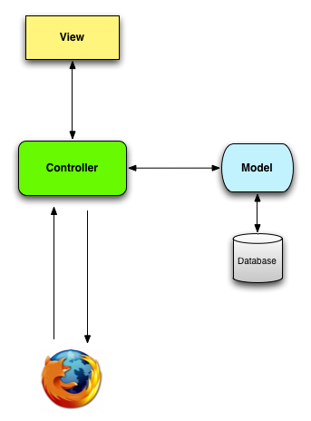
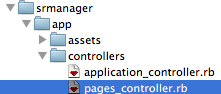
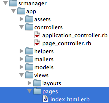
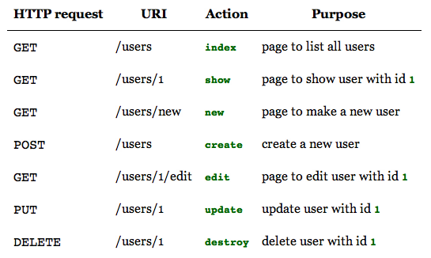
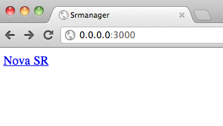
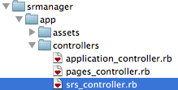
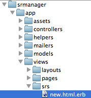

# Rails

## Nova Aplicação

Usaremos como **aplicação exemplo** um cadastro de SRs atendidas de cada sistema que também relacione o analista que a atendeu.

Crie a nova aplicação:

```bash
$ rails new srmanager -T -d mysql
```

Ajuste o seu ***Gemfile***:

```ruby
source "https://rubygems.org"

gem "rails", "3.2.6"
gem "mysql2"

group :assets do
  gem "sass-rails",   "~> 3.2.3"
  gem "therubyracer", :platforms => :ruby
  gem "uglifier", ">= 1.0.3"
end

gem "jquery-rails"

group :development, :test do
  gem "rspec-rails"
  gem "capybara"
  gem "thin"
  gem "rspec-rails"
end
```

SEMPRE que atualizar seu ***Gemfile***, execute:

```bash
$ bundle install
```

## Primeiros Passos com RSpec

Integre o rspec com o Rails:

```bash
$ rails generate rspec:install
```

Crie esqueleto do teste de integração:

```bash
$ rails generate integration_test cadastra_sr
```
 
Edite o arquivo criado pelo comando anterior, deixando-o com o seguinte conteúdo:

```ruby
# encoding: utf-8

require "spec_helper"

describe "Cadastra SRs" do
  context "quando enviando dados válidos" do
    
    before do
      visit "/"
      click_link "Cadastrar SR"
      
      fill_in "Número da SR", :with => "SR12001234"
      select "DSF", :from => "Sistema"
      select "Robert Plant", :from => "Analista"
      fill_in "Projeto", :with => "23o dígito"
      fill_in "Conclusão da SR", :with => "Tudo certo!"
      click_button "Adicionar SR"
    end
    
    it "redireciona para página de cadastro de SR"
    it "mostra mensagem de sucesso"
    it "mostra a SR cadastrada"
  end
  
  context "quando enviando dados inválidos" do
    
    before do
      visit "/"
      click_link "Cadastrar SR"
    end

    it "renderiza a página de cadastro de SR"
    it "mostra mensagem de erro"
  end    
end
```

Ainda não temos os testes implementados, mas neste arquivo já podemos verificar o quão simples é a DSL do RSpec. Ao ser executado, ele mostrará nossos testes com o status ***pending***:

```bash
$ rspec  spec/requests/cadastra_srs_spec.rb 

*****

Pending:
  Cadastra SRs quando enviando dados válidos redireciona para página de cadastro de SR
    # Not yet implemented
    # ./spec/requests/cadastra_srs_spec.rb:20
  Cadastra SRs quando enviando dados válidos mostra mensagem de sucesso
    # Not yet implemented
    # ./spec/requests/cadastra_srs_spec.rb:21
  Cadastra SRs quando enviando dados válidos mostra a SR cadastrada
    # Not yet implemented
    # ./spec/requests/cadastra_srs_spec.rb:22
  Cadastra SRs quando enviando dados inválidos renderiza a página de cadastro de SR
    # Not yet implemented
    # ./spec/requests/cadastra_srs_spec.rb:32
  Cadastra SRs quando enviando dados inválidos mostra mensagem de erro
    # Not yet implemented
    # ./spec/requests/cadastra_srs_spec.rb:33

Finished in 0.00056 seconds
5 examples, 0 failures, 5 pending
```

Agora, vamos começar a implementar as verificações, também conhecidas como *asserts*. Deixe o mesmo arquivo com o seguinte conteúdo:

```ruby
# encoding: utf-8

require "spec_helper"

describe "Cadastra SRs" do
  context "quando enviando dados válidos" do
    
    before do
      visit "/"
      click_link "Cadastrar SR"
      
      fill_in "Número da SR", :with => "SR12001234"
      select "DSF", :from => "Sistema"
      select "Robert Plant", :from => "Analista"
      fill_in "Projeto", :with => "23o dígito"
      fill_in "Conclusão da SR", :with => "Tudo certo!"
      click_button "Adicionar SR"
    end
    
    it "redireciona para página de cadastro de SR" do
      current_path.should be(sr_path)
    end
    it "mostra mensagem de sucesso" do
      page.should have_content("SR12001234 adicionada com sucesso!")
    end
    it "mostra a SR cadastrada" do
      current_path.should match(%r[/sr/\d+])
    end
  end
  
  context "quando enviando dados inválidos" do
    
    before do
      visit "/"
      click_link "Cadastrar SR"
    end

    it "renderiza a página de cadastro de SR"
    it "mostra mensagem de erro"
  end    
end
```

Execute o teste novamente e verifique a mensagem de erro:

```bash
$ rspec  spec/requests/cadastra_srs_spec.rb 
FFF**

Pending:
  Cadastra SRs quando enviando dados inválidos renderiza a página de cadastro de SR
    # Not yet implemented
    # ./spec/requests/cadastra_srs_spec.rb:38
  Cadastra SRs quando enviando dados inválidos mostra mensagem de erro
    # Not yet implemented
    # ./spec/requests/cadastra_srs_spec.rb:39

Failures:

  1) Cadastra SRs quando enviando dados válidos redireciona para página de cadastro de SR
     Failure/Error: Unable to find matching line from backtrace
     Mysql2::Error:
       Unknown database 'srmanager_test'
     # /Users/datherra/.rvm/gems/ruby-1.9.3-p194/gems/mysql2-0.3.11/lib/mysql2/client.rb:44:in `connect'
```

3 testes falharam. Como todos foram pelo mesmo motivo, removi algumas linhas do erro.
A linha `Mysql2::Error: Unknown database 'srmanager_test'` é bem autoexplicativa e esperada, já que ainda não criamos a base de dados desta aplicação.

Vamos criá-la?

## Criando a Base de Dados

Simples assim:

```bash
$ rake db:create
```
(aqui pode ser bom falar um pouco sobre o rake, pra que serve, etc)

Rode o teste novamente, desta vez, vamos rodar através do *rake*, que dá no mesmo:

```bash
$ rake spec:requests
/Users/datherra/Devel/Ruby/Rails/apps/srmanager/db/schema.rb doesn't exist yet. Run `rake db:migrate` to create it then try again. If you do not intend to use a database, you should instead alter /Users/datherra/Devel/Ruby/Rails/apps/srmanager/config/application.rb to limit the frameworks that will be loaded
```

Opa, novo erro =(  
Mas a solução já vem indicada no próprio erro. (Conseguiu achar?)  
Rode:

```bash
$ rake db:migrate
```

Rode o teste novamente:
```bash
$ rake spec:requests
/Users/datherra/.rvm/rubies/ruby-1.9.3-p194/bin/ruby -S rspec ./spec/requests/cadastra_srs_spec.rb
FFF**

Pending:
  Cadastra SRs quando enviando dados inválidos renderiza a página de cadastro de SR
    # Not yet implemented
    # ./spec/requests/cadastra_srs_spec.rb:38
  Cadastra SRs quando enviando dados inválidos mostra mensagem de erro
    # Not yet implemented
    # ./spec/requests/cadastra_srs_spec.rb:39

Failures:

  1) Cadastra SRs quando enviando dados válidos redireciona para página de cadastro de SR
     Failure/Error: click_link "Cadastrar SR"
     Capybara::ElementNotFound:
       no link with title, id or text 'Cadastrar SR' found
     # (eval):2:in `click_link'
     # ./spec/requests/cadastra_srs_spec.rb:10:in `block (3 levels) in <top (required)>'

  2) Cadastra SRs quando enviando dados válidos mostra mensagem de sucesso
     Failure/Error: click_link "Cadastrar SR"
     Capybara::ElementNotFound:
       no link with title, id or text 'Cadastrar SR' found
     # (eval):2:in `click_link'
     # ./spec/requests/cadastra_srs_spec.rb:10:in `block (3 levels) in <top (required)>'

  3) Cadastra SRs quando enviando dados válidos mostra a SR cadastrada
     Failure/Error: click_link "Cadastrar SR"
     Capybara::ElementNotFound:
       no link with title, id or text 'Cadastrar SR' found
     # (eval):2:in `click_link'
     # ./spec/requests/cadastra_srs_spec.rb:10:in `block (3 levels) in <top (required)>'

Finished in 0.3224 seconds
5 examples, 3 failures, 2 pending

Failed examples:

rspec ./spec/requests/cadastra_srs_spec.rb:20 # Cadastra SRs quando enviando dados válidos redireciona para página de cadastro de SR
rspec ./spec/requests/cadastra_srs_spec.rb:23 # Cadastra SRs quando enviando dados válidos mostra mensagem de sucesso
rspec ./spec/requests/cadastra_srs_spec.rb:26 # Cadastra SRs quando enviando dados válidos mostra a SR cadastrada
rake aborted!
/Users/datherra/.rvm/rubies/ruby-1.9.3-p194/bin/ruby -S rspec ./spec/requests/cadastra_srs_spec.rb failed

Tasks: TOP => spec:requests
(See full trace by running task with --trace)
```

Ok, agora o erro mudou.
Temos uma *exception* lançada pelo ***Capybara***, que é a lib usada pelo RSpec para simular a navegação do usuário em um site. A *exception* diz:

```ruby
Failure/Error: click_link "Cadastrar SR"
Capybara::ElementNotFound: no link with title, id or text 'Cadastrar SR' found
# (eval):2:in `click_link'
# ./spec/requests/cadastra_srs_spec.rb:10:in `block (3 levels) in <top (required)>'
```

Faz sentido, já que pedimos para o teste clicar no link "Cadastrar SR", mas ele ainda não existe.

Qual o próximo passo?  
Repare nestas linhas de nosso teste:

```ruby
  visit "/"
  click_link "Cadastrar SR"
```

Quando o usuário ***visita a raiz da aplicação***, o que é exibido no browser?  
Vamos verificar?  

## Server

Para subir a aplicação, basta executar o comando abaixo na raiz do projeto, neste caso, na pasta ***srmanager***:

```bash
$ rails server
```

Ou então, para economizar ponta de dedo:

```bash
$ rails s
=> Booting Thin
=> Rails 3.2.6 application starting in development on http://0.0.0.0:3000
=> Call with -d to detach
=> Ctrl-C to shutdown server
>> Thin web server (v1.3.1 codename Triple Espresso)
>> Maximum connections set to 1024
>> Listening on 0.0.0.0:3000, CTRL+C to stop
```

Detalhando o *output* do comando:

* `=> Booting Thin`  
***Thin*** é o *application server* que estamos usando, graças esta linha em nosso *Gemfile*:
```ruby
gem "thin"
```
O *application server* padrão do Rails é o ***WEBrick***, mas bisbilhotando e conversando com alguns desenvolvedores Rails mais experientes, fiquei sabendo que o Thin é mais rápido. Se no seu ambiente você usar o *WEBrick*, não tem problema, pois nada muda no código da aplicação. As diferenças poderiam começar a aparecer apenas no caso de você precisar ajustar alguma configuração muito específica deste *middleware*.

* `=> Rails 3.2.6 application starting in development on http://0.0.0.0:3000`  
Versão do Rails e a URL onde ele está ouvindo. Copie esta URL e cole no seu navegador.  

Esta página deverá aparecer:



Esta página é mostrada por padrão no Rails e ela fica em *srmanager/public/index.html*  
Bem, ela não tem o link "Cadastrar SR" como esperado pelo nosso teste, não é mesmo? Já que não vamos utilizá-la, apague o arquivo:

```bash
$ rm public/index.html
```

Sem mesmo reiniciar o servidor Rails, recarregue a página no seu browser. Isto é o que temos agora:



Algumas dicas aparecem neste passo:

1. Repare que na janela que você deixou rodando seu *rails server* apareceram algumas mensagens. Lá é exibido o *output* do servidor, que muitas vezes possui mensagens úteis para um *troubleshooting*. Vale dizer que estas mesmas mensagens podem ser encontradas no arquivo `log/development.log`

2. O erro no browser acompanha uma sugestão:
Try running `rake routes` for more information on available routes.

Ok então. Execute:
```bash
$ rake routes
```
***Nada!?***  

Pois é, ainda não definimos nenhuma rota em nossa aplicação. Mas...  
...que diabos são ***ROTAS!?***


## Routes

Citando o [*Rails Routing from the Outside In*](http://guides.rubyonrails.org/routing.html) :  

> *The Rails router recognizes URLs and dispatches them to a controller’s action. It can also generate paths and URLs, avoiding the need to hardcode strings in your views.*  

Pois bem, se é ele quem decide para onde mandar o usuário quando os *requests* do browser chegam ao Rails, precisamos configurar o que fazer quando o usuário solicitar o "/" (barra).  

O arquivo *config/routes.rb* é criado junto com aplicação e possui vários exemplos comentados. Para simplificar, irei apagar todas as linhas comentadas e ir adicionando somente as úteis para a aplicação.  

Edite o arquivo *config/routes.rb* e deixe-o assim:
```ruby
Srmanager::Application.routes.draw do
  root :to => "pages#index"
end
```

Em aplicações web é comum possuirmos as páginas que lidam com conteúdo dinâmico, que são aquelas por onde se manipula informações que são extraídas e salvas de algum repositório de dados, normalmente um banco de dados.  

Mas há também as páginas estáticas, como uma *home page*, página institucional com informações da empresa, *about page* com informações básicas da própria aplicação, etc. Para estes casos, é muito comum na comunidade Rails o uso de um *controller* chamado *pages* ou *site* que servirá apenas para servir suas páginas estáticas.  

No trecho de código que colocamos no *routes.rb* estamos indicando que, toda vez que alguém visitar a raiz da aplicação, ela deverá ser redirecionada a *ACTION* ***index*** do *CONTROLLER* ***pages***.

Salve o *routes.rb* e verifique suas rotas novamente:

```bash
$ rake routes
root  / pages#index
```

Vimos que a rota relacionada ao "/" foi adicionada.  

Agora, rode o teste:

```bash
$ rspec spec/requests/cadastra_srs_spec.rb 
FFF**

Pending:
  Cadastra SRs quando enviando dados inválidos renderiza a página de cadastro de SR
    # Not yet implemented
    # ./spec/requests/cadastra_srs_spec.rb:38
  Cadastra SRs quando enviando dados inválidos mostra mensagem de erro
    # Not yet implemented
    # ./spec/requests/cadastra_srs_spec.rb:39

Failures:

  1) Cadastra SRs quando enviando dados válidos redireciona para página de cadastro de SR
     Failure/Error: visit "/"
     ActionController::RoutingError:
       uninitialized constant PagesController
     # ./spec/requests/cadastra_srs_spec.rb:9:in `block (3 levels) in <top (required)>'
```

Antes de analizarmos o erro, vamos mudar uma configuração do RSpec para que o *output* dele fique mais bacana. Edite o arquivo `.rspec` na raiz do projeto e atualize-o para este conteúdo:

```
--colour --format documentation
```

Rode o teste novamente e repare na diferença do *output*:

```bash
Cadastra SRs
  quando enviando dados válidos
    redireciona para página de cadastro de SR (FAILED - 1)
    mostra mensagem de sucesso (FAILED - 2)
    mostra a SR cadastrada (FAILED - 3)
  quando enviando dados inválidos
    renderiza a página de cadastro de SR (PENDING: Not yet implemented)
    mostra mensagem de erro (PENDING: Not yet implemented)
```

Este sumário do resultado dos testes é muito útil por já deixar claro quais funcionalidades falharam e também nos ajuda a construir descritivos coerentes para os testes, já que eles ao serem lidos desta forma, lhe direcionarão mais rapidamente ao problema (quando houver um).  

Voltando ao erro:

```ruby
Failure/Error: visit "/"
ActionController::RoutingError:
  uninitialized constant PagesController
# ./spec/requests/cadastra_srs_spec.rb:9:in `block (3 levels) in <top (required)>'
```

Bem, como instruímos o Rails a redirecionar os usuários que procuram a raiz da aplicação para *"pages#index"*, vamos ter que criar este *controller* citado no erro, o ***PagesController***.  

## Criando entidades da aplicação

Lembra deste desenho?



A grande maioria das entidades que usarmos nas aplicações, passarão por estes 3 componentes: o ***Controller***, o ***Model*** e a ***View***.

Vamos começar criando o ***Controller*** que nosso teste está pedindo.  
Conforme a imagem a abaixo, crie o arquivo *pages_controller.rb* na pasta *app/controllers/* :



Para criarmos um controller no Rails, apenas extenda a classe ***ApplicationController***:

```ruby
class PagesController < ApplicationController
  
end
```

Salve o arquivo e, adivinhe, rode o teste *again!*

```bash
$ rake spec:requests
```

Para economizar espaço, irei colar aqui apenas o trecho relevante do *output* do RSpec:

```ruby
Failure/Error: visit "/"
AbstractController::ActionNotFound:
  The action 'index' could not be found for PagesController
```

Bom, resolvemos o erro que reclamava do ***PagesController***.  
Agora precisamos resolver o próximo erro, o da *action* ***index***.  

Em Rails, *actions* são simples métodos dos *controllers*, portanto, no arquivo `pages_controller.rb`, dentro da classe ***PagesController*** defina o método ***index***:

```ruby
class PagesController < ApplicationController
  def index
    
  end
end
```

Teste.
```bash
$ rake spec:requests
```

Novo erro:

```ruby
Failure/Error: visit "/"
 ActionView::MissingTemplate:
   Missing template pages/index, application/index with {:locale=>[:en], :formats=>[:html], :handlers=>[:erb, :builder]}. Searched in:
     * "/Users/datherra/Devel/Ruby/Rails/apps/srmanager/app/views"
 # ./spec/requests/cadastra_srs_spec.rb:9:in `block (3 levels) in <top (required)>'
```

*ActionView::MissingTemplate*!  
Pois bem, já passamos do *controller* e chegamos agora no outro componente, a *view*.  

Vamos criá-la?  

## View

A *view* é o que utilizamos para solicitar e mostrar dados aos usuários. E ela que traz ou leva as informações devidamente tratadas em nossos controladores.  
Até aqui ainda não colocamos nenhuma inteligência no *controller*, mas isso irá mudar mais adiante.  

Vamos detalhar esta linha do erro:

```ruby
Missing template pages/index, application/index with {:locale=>[:en], :formats=>[:html], :handlers=>[:erb, :builder]}
```

* Missing template pages/index  
indica qual a página que está faltando, neste caso, http://servidor/pages/index
* :locale=>[:en]  
ajuda a definir qual template renderizar baseado no idioma detectado no navegador (fora do escopo deste tutorial)
* :formats=>[:html]  
qual formato está sendo solicitado e portanto o que deverá ser comtemplado pelo template. Neste caso mostra ":html" porque utilizamos o browser (o RSpec simula o *request* de um browser). Poderia ser XML ou JSON, por exemplo.
* :handlers=>[:erb, :builder]  
qual parser/handler/template engine (chame como preferir) que será usado para renderizar este template

Sendo mais prático, vamos corrigir o erro.  
Na pasta *app/view* crie a subpasta *pages* (repare no plural), e dentro dela o arquivo *index.html.erb*:



Deixe o arquivo *index.html* vazio mesmo.

***Teste*** (preciso colocar o comando aqui? Acho que não mais né?)  

Novo erro:

```ruby
Failure/Error: click_link "Cadastrar SR"
Capybara::ElementNotFound:
  no link with title, id or text 'Cadastrar SR' found
# (eval):2:in `click_link'
# ./spec/requests/cadastra_srs_spec.rb:10:in `block (3 levels) in <top (required)>'
```

Faz sentido não é?  
Recarregue a página no browser, e você verá apenas uma página vazia, sem erros, o que já é bom sinal.  

O teste está reclamando que não encontra o link "Cadastrar SR".  

Vamos criá-lo?

## ERB e mais Routes

Citando a [apostila gratuíta](http://www.caelum.com.br/apostilas/) do curso de Rails da Caelum:

> ***ERb***  
> ERb é uma implementação de eRuby que já acompanha a linguagem Ruby. Seu funcionamento é similar ao dos arquivos JSP/ASP: arquivos html com injeções de código. A idéia é que o HTML serve como um template, e outros elementos são dinâmicamente inseridos em tempo de renderização.
Para uma página aceitar código Ruby, ela deve estar entre "<%" e "%>". Há uma variação deste operador, o "<%=", que não só executa códigos Ruby, mas também imprime o resultado na página HTML.
> É importante notar que todos os atributos de instância (@variavel) de um controlador estão disponíveis em sua view.

De volta ao arquivo *app/views/pages/index.html*, aplique este conteúdo para criarmos o link "Cadastrar SR":

```ruby
<%= link_to "Cadastrar SR", new_sr_path %>
```

Rode o teste.  
Erro:

```ruby
Failure/Error: visit "/"
ActionView::Template::Error:
  undefined local variable or method `new_sr_path' for #<#<Class:0x00000128de3388>:0x000001012b41a0>
```

Que diabos é este `new_sr_path` afinal? E o `link_to`?  

O *link_to* é o que no Rails são chamados de *helpers methods*. Este em específico tem a óbvia função de transformar os argumentos que passaremos à ele em uma tag html como:

```html
<a href="sr/new">Cadastrar SR</a>
```

Ok, a parte do "Cadastrar SR" ficou clara, mas e o outro argumento? Como transformar ***new_sr_path*** em ***sr/new***?  

Conseguimos fazer isso declarando um ***resource*** no arquivo ***config/rotas.rb***. Deixe o seu arquivo com este conteúdo:

```ruby
Srmanager::Application.routes.draw do
  root :to => "pages#index"
  resource :sr
end
```

Esta simples linha
```ruby
resource :sr
```

produz um série de rotas e helpers. Após salvar o arquivo `routes.rb`, rode:

```bash
$ rake routes
   root        /                  pages#index
     sr POST   /sr(.:format)      srs#create
 new_sr GET    /sr/new(.:format)  srs#new
edit_sr GET    /sr/edit(.:format) srs#edit
        GET    /sr(.:format)      srs#show
        PUT    /sr(.:format)      srs#update
        DELETE /sr(.:format)      srs#destroy
```

Repare na linha:
```bash
 new_sr GET    /sr/new(.:format)  srs#new
```

* new_sr - nome do helper criado pelo rails para se referir a esta rota via código (justamente a que usamos no arquivo *index.html* após o `link_to`)
* GET - método HTTP usado
* /sr/new(.:format) - é a URL para a qual o helper indicado na primeira coluna é "traduzido" (e também é justamente o link que queríamos)
* srs#new - significa que esta rota tem como destino o *controller* ***srs*** com a *action* ***new***. Vamos precisar disso já já.

Para compreender melhor esta parte, vale usar esta tabela como referência. Ela seria o resultado de `resource :user`:

  
fonte: [Rails Tutorial](http://ruby.railstutorial.org/chapters/a-demo-app#sec:demo_users_resource)  

Outra excelente fonte de informação sobre este tópico está nos guias do próprio Rails:  
http://guides.rubyonrails.org/routing.html    

Rode o teste.  

```ruby
Failure/Error: click_link "Cadastrar SR"
 ActionController::RoutingError:
   uninitialized constant SrsController
```

Reclamou do ***SrsController***, mas não reclamou mais da falta do link "Cadastar SR". Abra http://localhost:3000 no seu navegador e verifique que o link está lá:  



Vamos criar o novo *controller*?

## Um novo Controller

Crie o arquivo `srs_controller.rb` no diretório indicado abaixo:  

  

O arquivo deve ficar com este conteúdo:  

```ruby
class SrsController < ApplicationController
  
end
```

Rode o teste.  

```ruby
Failure/Error: click_link "Cadastrar SR"
AbstractController::ActionNotFound:
  The action 'new' could not be found for SrsController
```

Agora ele diz não encontrar a *action* ***new***. Crie:

```ruby
class SrsController < ApplicationController
  def new
    
  end
end
```

Rode o teste. Erro:  

```ruby
Failure/Error: click_link "Cadastrar SR"
ActionView::MissingTemplate:
  Missing template srs/new, application/new with {:locale=>[:en], :formats=>[:html], :handlers=>[:erb, :builder]}. Searched in:
    * "/Users/datherra/Devel/Ruby/Rails/apps/srmanager/app/views"
```

*Missing Template*? Já passamos por isso, lembra?  
Vamos criar o template da *action* ***new*** que ele está esperando criando a pasta e o arquivo demonstrado abaixo:  

  

Salve o arquivo em branco mesmo e...  

Rode o teste. Novo erro:  

```ruby
Failure/Error: fill_in "Número da SR", :with => "SR12001234"
 Capybara::ElementNotFound:
   cannot fill in, no text field, text area or password field with id, name, or label 'Número da SR' found
```

Não achou o campo "Número da SR", que de acordo com nosso teste, seria o primeiro campo do formuládio de cadastro da SR a ser preenchido. Lembra do bloco *before* do nosso teste?  

```ruby
before do
  visit "/"
  click_link "Cadastrar SR"
  
  fill_in "Número da SR", :with => "SR12001234"
  select "DSF", :from => "Sistema"
  select "Robert Plant", :from => "Analista"
  fill_in "Projeto", :with => "23o dígito"
  fill_in "Conclusão da SR", :with => "Tudo certo!"
  click_button "Adicionar SR"
end
```

Vamos agora conhecer as facilidades, ou na linguagem *Rails*, os ***helpers*** para criação de formulários Web. Preencha o arquivo *app/views/srs/new.html.erb* com o seguinte conteúdo:  

```erb
<%= form_for @sr do |f| %>
  <p>
    <%= f.label :numero_sr, "Número da SR" %>
    <%= f.text_field :numero_sr %>
  </p>
  
  <p>
    <%= f.label :sistema_id, "Sistema" %>
    <%= f.collection_select :sistema_id,
          Sistema.all,
          :id,
          :nome,
          :include_blank => true
    %>
  </p>

  <p>
    <%= f.label :analista_id, "Analista" %>
    <%= f.collection_select :analista_id,
          Analista.all,
          :id,
          :nome,
          :include_blank => true
    %>
  </p>
  
  <p>
    <%= f.label :projeto, "Projeto" %>
    <%= f.text_field :projeto %>
  </p>
  
  <p>
    <%= f.label :conclusao, "Conclusão da SR" %>
    <%= f.text_area :conclusao, :rows => 3 %>
  </p>
  
  <p>
    <%= f.submit "Envia SR", :class => "btn btn-primary" %>
  </p>
  
<% end %>
```

Rode o teste. Erro:  

```ruby
Failure/Error: click_link "Cadastrar SR"
ActionView::Template::Error:
  undefined method `model_name' for NilClass:Class
```

###Aqui vou descrever um trobleshooting e porque ele é necessário.

O Rails é um *framework* que adere ao [***Convention over Configuration***](http://en.wikipedia.org/wiki/Convention_over_configuration), que resumidamente significa que ele espera que você cumpra (e decore) algumas convenções para não passar horas ajustando e debugando XMLs de configuração, algo muito comum em ambiente JavaEE.  

Uma destas convenções tem relação com o plural ou singular para nomear classes, variáveis e arquivos encontrados nas *views*, *models* e *controllers*.  

Comecemos por esta [lista](http://underpop.free.fr/r/ruby-on-rails/cookbook/I_0596527314_CHP_2_SECT_6.html):  

* Database table names: plural
> Database table names are expected to be pluralized. For example, a table containing ***employee*** records should be named ***Employees***.

* Model class names: singular
> Model class names are the singular form of the database table that they are modeling. For example, an ***Employee*** model is created based on a table named ***employees***.

* Controller class names: plural
> Controller class names are pluralized, such as ***EmployeesController*** or ***AccountsController***.  

Uma maneira de percebermos como funciona a pluralização nos nomes das pastas e arquivos do Rails, é solicitando o *scaffolding* de um objeto. Execute o comando abaixo, que por causa do parâmetro `-p` irá somente fingir (*pretend*) que executa o comando:

```bash
$ rails generate scaffold User -p
      invoke  active_record
      create    db/migrate/20120808212428_create_users.rb
      create    app/models/user.rb
      invoke    rspec
      create      spec/models/user_spec.rb
      invoke  resource_route
       route    resources :users
      invoke  scaffold_controller
      create    app/controllers/users_controller.rb
      invoke    erb
      create      app/views/users
      create      app/views/users/index.html.erb
      create      app/views/users/edit.html.erb
      create      app/views/users/show.html.erb
      create      app/views/users/new.html.erb
      create      app/views/users/_form.html.erb
      invoke    rspec
      create      spec/controllers/users_controller_spec.rb
      create      spec/views/users/edit.html.erb_spec.rb
      create      spec/views/users/index.html.erb_spec.rb
      create      spec/views/users/new.html.erb_spec.rb
      create      spec/views/users/show.html.erb_spec.rb
      invoke      helper
      create        spec/helpers/users_helper_spec.rb
      create      spec/routing/users_routing_spec.rb
      invoke      rspec
      create        spec/requests/users_spec.rb
      invoke    helper
      create      app/helpers/users_helper.rb
      invoke      rspec
      invoke  assets
      invoke    js
      create      app/assets/javascripts/users.js
      invoke    scss
      create      app/assets/stylesheets/users.css.scss
      invoke  scss
      create    app/assets/stylesheets/scaffolds.css.scss
```

|Model|Route|Controller|View|
|:---------|----------:|:----------:|:----------:|
|app/models/user.rb|resources :users|app/controllers/users_controller.rb|app/views/users/*.html.erb|  

Lembre-se, como usou o `-p` nada foi criado na sua *app*.  

Existe uma classe no Rails (`ActiveSupport::Inflector::Inflections`) responsável por dar o correto plural a cada palavra. Mas ele trata de fazer isto com o inglês, por isso é sempre mais fácil nomear tudo em sua *app* em inglês.  

Mas se não for possível, não tem problema, existem alguns meios de lidar com isso.  

Por exemplo nesta *app* não tivemos problema até agora com o objeto **Sr**, mas o erro que apareceu por último aconteceu após termos adicionado o nome de duas novas **Classes** (que ainda serão criadas): **Sistema** e **Analista**.  

Existe uma ferramenta ***MUITO*** útil para o desenvolvedor Rails que é o **Console**. Execute:  

```bash
$ rails console
Loading development environment (Rails 3.2.6)
1.9.3p194 :001 > 
```

Você terá carregado um *prompt* interativo de Ruby, o famoso ***irb***, mas no contexto de sua aplicação. Teste:  

```ruby
 > "Sr".pluralize
 => "Srs" 
 > "Sistema".pluralize
 => "Sistemas" 
 > "Analista".pluralize
 => "Analista" 
```

Veja como a palavra *Analista* não teve seu plural aplicado corretamente. Lembrando que as outras duas terem dado certo foi sorte, já que nem palavras do inglês elas são.  

Este foi o motivo do último erro que encontramos.  

Vamos então "ensinar" para o Rails o plural de *Analista*.  
Edite o arquivo `config/initializers/inflections.rb` e adicione o conteúdo abaixo:

```ruby
ActiveSupport::Inflector.inflections do |inflect|
  inflect.plural /^(analista)$/i, '\1s'
  inflect.singular /^(analista)s$/i, '\1'
end
```

Abra um `rails console` e faça os testes de pluralização novamente. Se sua sessão de console já estava aberta, tente atualizar as configurações com o comando abaixo, se não funcionar, reinicie o console:  

```ruby
001 > reload!
Reloading...
=> true 
 
002 > "Sr".pluralize
=> "Srs" 
003 > "Sistema".pluralize
=> "Sistemas" 
004 > "Analista".pluralize
=> "Analistas" 
```

Agora a palavra "Analista" teve seu plural aplicado corretamente.  
Além de ajustar estas correções através de *Inflections*, também existe um projeto chamado [*brazilian-rails*](https://github.com/tapajos/brazilian-rails) que pode ser útil.  

Voltando ao projeto, rode os testes novamente. Novo erro:  

```ruby
Failure/Error: click_link "Cadastrar SR"
ActionView::Template::Error:
  undefined method `model_name' for NilClass:Class
```

Agora o teste reclama da falta do **MODEL** (*model_name*). É justo, já que estamos tentando salvar um *Sr* mas ainda não definimos como salvá-la no banco de dados.  

Como o Rails foi criado pensando na forma **ÁGIL** de se desenvolver software web, as modificações no banco de dados são feitas aos poucos, conforme a necessidade aparece, assim como todo o resto que tratamos até aqui.  

Estas alterações são aplicadas através de ***migrations***, que são pequenas classes Ruby, filhas da classe Rails `ActiveRecord::Migration`, que possuem instruções de como **FAZER** e como **DESFAZER** as modificações que você precisa.  

Ensinar a desfazer ajuda no rollback de alterações na base.  

O Rails aplica estas migrações na sequência em que elas foram criadas, tomando como referência o *timestamp* existente no nome dos arquivos de migrações.  

Isso significa duas coisas:  
1 usaremos um script do Rails para facilitar a criação do arquivo de migrações já com o *timestamp* definido;
2 se precisar fazer ajustes a uma *migration* já criada, não altere o arquivo existente, crie uma outra *migration* somente com os ajustes que precisa, fazendo com que suas alterações sejam sempre incrementais e sequenciais.  

Vamos criar o primeiro **MODEL**?

# Model  

